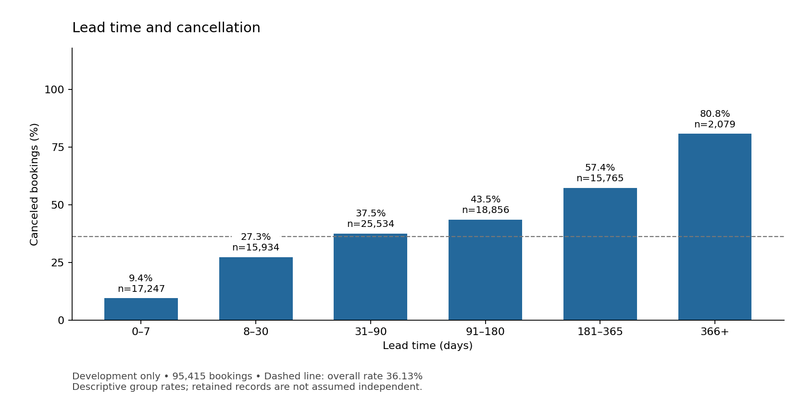
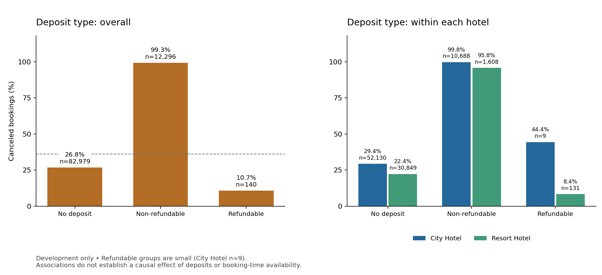
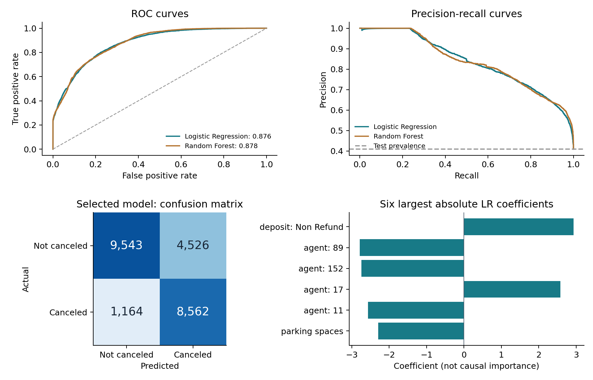

# Hotel Booking Cancellation Project

**CSE437: Data Science | Section 05 | Summer 2026 | Group 15**

A leakage-aware, chronological comparison of Logistic Regression and Random Forest

| Member | Student ID |
| --- | --- |
| Faraaz Jamil Chowdhury | 24241205 |
| Ihfaz Rashid Sadat | 23301499 |

**Report date:** 3 September 2026

**Repository:** [cse437-hotel-cancellation-15](https://github.com/faraaz1027-cloud/cse437-hotel-cancellation-15)

## Summary

Hotel cancellations complicate revenue planning and room allocation. This project uses the Hotel Booking Demand dataset, containing 119,390 city and resort hotel reservations, to predict the binary target is_canceled. After excluding 180 confirmed zero-guest records, a chronological design reserves 95,415 bookings for development and 23,795 later bookings for testing. Missing-value handling, encoding, feature selection and numeric transformations are fitted only within training partitions. Logistic Regression and Random Forest are compared with a majority baseline; numeric PCA is evaluated but not retained because selection alone performs better in development. Grid search selects balanced Logistic Regression with C=1 and a fixed 0.5 threshold. It achieves test F1 of 0.7506, accuracy of 76.09% and recall of 88.03%. The most important finding is that deposit type has a pronounced association with cancellation, although retrospective recording and repeated booking profiles prevent a causal interpretation. Random Forest and baseline test scores are disclosed as a later reporting supplement, not a new selection exercise. False alerts, weaker short-lead performance and uncalibrated probabilities limit operational use.

<!-- pagebreak -->

## 1. Problem and Dataset

### 1.1 Problem statement

Hotel booking cancellations can cause loss of money and make room planning difficult for hotels. The goal of this project is to study the factors that affect booking cancellations and build a machine-learning model that can predict whether a hotel booking will be canceled.

### 1.2 Dataset

The supplied Hotel Booking Demand CSV has 119,390 rows, 32 columns and 16,855,599 bytes, covering arrivals from 1 July 2015 to 31 August 2017. It contains 79,330 City Hotel and 40,060 Resort Hotel records. Collection Method - The data were collected from the property management systems (PMS) of a city hotel and a resort hotel in Portugal. The Kaggle distribution by Jesse Mostipak acknowledges earlier preparation by Thomas Mock and Antoine Bichat [1]. This project uses that supplied combined CSV; it does not scrape or merge another dataset.

### 1.3 Target variable

The binary target is is_canceled: 1 means canceled and 0 means not canceled. The raw counts are 44,224 canceled and 75,166 not canceled (37.04% versus 62.96%). Excluding 180 confirmed zero-total-guest rows leaves 119,210 bookings. Development contains 34,473 cancellations among 95,415 bookings (36.13%); the later test contains 9,726 among 23,795 (40.87%). Development-only statistics informed modeling.

### 1.4 Three questions

1. Which booking and customer-related factors have the biggest effect on hotel cancellations?
2. How accurately can machine-learning models predict whether a hotel booking will be canceled?
3. Which machine-learning model gives the best result after data preprocessing, feature selection, dimensionality reduction, and hyperparameter tuning?

## 2. Data Handling and Preprocessing

### 2.1 Data quality audit

| Raw-data issue | Recorded evidence |
| --- | --- |
| Missing values | children 4; country 488; agent 16,340; company 112,593 |
| Other columns | No missing values detected |
| Exact duplicate copies beyond the first | 31,994; retained because no booking ID resolves genuine repeats |
| Guest totals | 180 confirmed zeros; 4 unknown totals; no negative guest counts |
| Explicit Undefined categories | meal 1,169; market_segment 2; distribution_channel 5 |
| ADR | Minimum -6.38; maximum 5,400; one negative value |

Both reservation_status and reservation_status_date encode outcomes and are excluded from predictors. Undefined category values remain distinct from missing values. The original full-source quality audit preceded splitting; this inspection is disclosed rather than described as an entirely untouched-data workflow.

<!-- pagebreak -->

### 2.2 Missing values

Mechanisms are unverified. Agent/company NULLs are treated as potentially structural, for example when no agent or company is associated with a booking; this is a working interpretation, not a confirmed missingness mechanism. Country/children/invalid ADR have unknown mechanisms; missing completely at random is not assumed.

| Field | Treatment and rationale |
| --- | --- |
| children / numeric missingness | Training median + children indicator; zero fallback for entirely missing training columns. |
| country | Explicit Unknown category; no country is fabricated. |
| agent | NoAgent for missing values; nominal string codes. |
| company | Drop sparse ID (94.31% missing); derive presence flag. |
| adr | Negative to missing; training median + indicator. |
| Derived totals/share | Propagate unknowns; training medians; indicators for total nights, total guests and cancellation share. |

### 2.3 Outliers

A raw ADR 1.5-IQR diagnostic (Q1=69.29, Q3=126; bounds -15.775/211.065) flagged 3,793 values, but missed the single negative ADR. These bounds were diagnostic, not deletion thresholds. Domain rules turn the negative value into missing; 1,959 raw zero-ADR values and high positive values, including 5,400, are retained. Only 180 confirmed zero-guest rows are excluded.

### 2.4 Transformation and scaling

After imputation, log1p transforms lead time, prior canceled/noncanceled bookings, ADR and three derived totals. LR uses StandardScaler; RF is unscaled. One-hot encoding maps unseen categories to an all-zero block. The split precedes learned preprocessing: imputers, scalers, vocabularies, selectors and PCA fit training partitions only.

Training ADR medians are 76.50/80.75/90.00; fold 3's negative validation ADR uses 90.00. Encoded widths are 328/422/491 with zero nonfinite outputs and matching train/validation width. Assigned room, booking changes and waiting-list days are excluded as potentially updated fields.

### 2.5 Before and after

| Stage | Rows | Predictor fields / encoded width |
| --- | ---: | --- |
| Raw CSV | 119,390 | 32 total columns |
| Separate target and two status fields | 119,390 | 29 candidate predictors |
| Remove confirmed zero guests | 119,210 | 29 candidates |
| Initial source-field policy | 119,210 | 25 source fields |
| Derived-feature schema | 119,210 eligible | 32 fields before encoding |
| Selected final LR representation | 95,415 fitted; 23,795 tested | 406 encoded features |

## 3. Statistical Analysis

### 3.1 Descriptive statistics

| Development field | Mean | Median | Q1-Q3 | Maximum |
| --- | ---: | ---: | --- | ---: |
| Lead time (days) | 96.59 | 60 | 15-145 | 737 |
| ADR, valid observed values | 93.71 | 88 | 65-115 | 5,400 |
| Previous cancellations | 0.106 | 0 | 0-0 | 26 |
| Weekday nights | 2.45 | 2 | 1-3 | 50 |

Lead time and ADR are right-skewed; prior cancellations concentrate at zero. Development has 62,827 City and 32,588 Resort bookings. Deposit frequencies are 82,979 No Deposit, 12,296 Non Refund and 140 Refundable. Full frequency/spread tables are in [development EDA](../data/README.md).

<!-- pagebreak -->

### 3.2 Relationships

Longer lead-time bands have progressively higher cancellation rates: 9.43% for 0-7 days (n=17,247) versus 80.81% for 366+ days (n=2,079). The direction is consistent within both hotels.

Non Refund has 99.25% cancellation, compared with 26.82% for No Deposit and 10.71% for Refundable. The latter has only 140 observations. Booking mix, policies and retrospective recording may contribute; the figures do not show that deposits cause cancellation.

### 3.3 What the data says so far

- Preserve lead time and deposit type as planned predictors; assess their limitations rather than infer causality.
- Prior-cancellation rates are non-monotonic: 32.07%, 95.65%, 31.29% and 74.77% for counts 0, 1, 2-3 and 4+. The last two groups have only 163 and 222 records.
- City Hotel cancellation is 41.41%, versus 25.94% for Resort Hotel; pooled patterns depend on hotel mix.
- Equal-profile weighting changes overall cancellation from 36.13% to 25.26%, and the 4+ prior-cancellation rate from 74.77% to 26.32%. Repetition sensitivity is substantial.
- Retain grouped, chronological validation. Do not use naive independent-row confidence intervals or describe EDA rates as model importance.

Equal-profile weighting averages conflicting labels within each of 67,961 candidate-profile groups. It describes the average profile rather than the average booking; it is a sensitivity analysis, not a replacement training population.

<!-- pagebreak -->

## 4. Feature Engineering

### 4.1 Derived features

| Constructed field(s) | Definition and reason |
| --- | --- |
| total_nights | Weekend plus weekday nights; booking duration. |
| total_guests | Adults plus children plus babies; party size. |
| previous_bookings_total | Previous canceled plus noncanceled bookings; history volume. |
| has_booking_history | Indicator of positive history total; distinguishes no history. |
| previous_cancellation_share | Canceled/history total; zero for no history, interpreted with the history flag. |
| company_code_recorded | Presence of a company code; recording proxy, not proof of corporate payment. |
| arrival_month_sin / arrival_month_cos | sin/cos of 2*pi*(month-1)/12; cyclic seasonality, replacing month names. |

These eight deterministic fields extend 24 retained source fields to 32 inputs. Unknown components propagate before imputation. The audit retains 604 zero-night development bookings and four unknown guest totals. Separately imputed totals need not equal sums of separately imputed components. Ratios, flags and calendar coordinates are not logged.

### 4.2 Dimensionality reduction

Centered full-SVD PCA retains at least 95% training variance in the scaled numeric block; category and missing-indicator columns bypass PCA. It reduces 23 numeric fields to 16/15/16 components across folds, retaining 95.88%/95.00%/95.69% variance. Selection-plus-PCA uses 15 components per fold. PCA is demonstrated but not retained: preserving variance did not improve the agreed development F1 over selection alone.

### 4.3 Feature selection

Training-constant encoded columns (variance at most 1e-12) are removed. Remaining columns are ranked by training-label ANOVA F; the top 75%, rounded upward, are retained, with ties resolved by encoded order. Scores are ranking heuristics, not causal importance or inferential p-values.

| Fixed representation with reference LR | Mean development F1 | Fold output widths |
| --- | ---: | --- |
| All engineered features | 0.693094 | 332 / 421 / 490 |
| Selection only | 0.713609 | 247 / 314 / 366 |
| Numeric PCA | 0.694633 | 325 / 413 / 483 |
| Selection then PCA | 0.701023 | 242 / 308 / 360 |

### 4.4 Final feature set

The 32 pre-encoding inputs are: lead_time; previous_cancellations; previous_bookings_not_canceled; adr; total_nights; total_guests; previous_bookings_total; arrival_date_year; arrival_date_week_number; arrival_date_day_of_month; stays_in_weekend_nights; stays_in_week_nights; adults; children; babies; is_repeated_guest; required_car_parking_spaces; total_of_special_requests; has_booking_history; previous_cancellation_share; company_code_recorded; arrival_month_sin; arrival_month_cos; hotel; meal; country; market_segment; distribution_channel; reserved_room_type; deposit_type; agent; customer_type.

The final training-fitted selection retains 406 encoded features, listed completely in [feature_coefficients.csv](../data/processed/results/evaluation/feature_coefficients.csv). The rule, not a global pre-CV mask, is refitted within each training partition. Dropped fields are the two outcome-status columns, raw company ID, assigned room, booking changes, waiting-list days and replaced month names. Selection is justified by the development comparison, not test performance; no isolated benefit is claimed for every engineered field.

<!-- pagebreak -->

## 5. Modeling and Validation

### 5.1 Validation strategy

The split uses whole arrival dates near an 80/20 row target: 95,415 development bookings (80.04%) end on 22 April 2017, and 23,795 test bookings begin on 23 April. Three expanding forward folds remain entirely within development. Boundaries are deterministic and do not use target labels; no random shuffle or label stratification is applied. Model seeds are 42.

| Fold | Training rows / end | Validation rows / period |
| --- | --- | --- |
| 1 | 23,797 / 26 Jan 2016 | 23,893 / 27 Jan-21 Jun 2016 |
| 2 | 47,690 / 21 Jun 2016 | 23,776 / 22 Jun-6 Nov 2016 |
| 3 | 71,466 / 6 Nov 2016 | 23,949 / 7 Nov 2016-22 Apr 2017 |

Candidate-profile groups cannot cross development/test or training/validation within a fold. This guards recorded duplicate profiles, not unobserved shared guests. There is no temporal embargo, and arrival cohorts do not establish real-time label availability. The design is retrospective, not a simulated live booking system.

### 5.2 Baseline

A training-majority DummyClassifier predicts not canceled. Its mean forward-validation F1 and recall are zero, despite 63.82% accuracy. This shows why majority accuracy is not an adequate success criterion.

### 5.3 Model families

Logistic Regression supplies a regularized linear log-odds baseline for encoded features; nonlinear relations require suitable transformations, and coefficients are not causal. Random Forest models nonlinear splits and interactions without numeric scaling, but can overfit repeated patterns and transfer poorly across time. Both full and selected representations are compared before tuning.

| Untuned candidate | Mean F1 | Precision | Recall |
| --- | ---: | ---: | ---: |
| Logistic Regression, full | 0.693094 | 0.681025 | 0.753386 |
| Logistic Regression, selected | 0.713609 | 0.783364 | 0.659498 |
| Random Forest, full | 0.626504 | 0.906662 | 0.481119 |
| Random Forest, selected | 0.657994 | 0.893717 | 0.521714 |

### 5.4 Metrics

The split plan fixes cancellation-class F1 as primary, aggregated by the unweighted mean across three folds. F1 balances precision and recall under moderate class imbalance. Accuracy, precision, recall and ROC-AUC provide context; Brier score is a later probability diagnostic. Undefined precision is reported as zero. Threshold remains 0.5. No measured business costs justify optimizing financial savings.

## 6. Hyperparameter Tuning

### 6.1 Search space

| Family | Searched hyperparameter | Values |
| --- | --- | --- |
| Logistic Regression | C | 0.01, 0.1, 1, 10 |
| Logistic Regression | class_weight | None, balanced |
| Random Forest | max_depth | 8, 16, None |
| Random Forest | min_samples_leaf | 1, 10 |
| Random Forest | class_weight | None, balanced |

<!-- pagebreak -->

### 6.2 Method

GridSearchCV evaluates 8 LR and 12 RF candidates over 3 frozen folds: 60 fits. Each complete pipeline refits preprocessing/selection on training only. LR uses lbfgs and max_iter=2000; RF uses 100 trees and sqrt feature sampling. Both use seed 42, selected representation and threshold 0.5. Search refit=False defers full-development fitting until selection is frozen.

### 6.3 Results

| Family and weights | Search trend: mean development F1 |
| --- | --- |
| LR, unweighted; C=0.01 / 0.1 / 1 / 10 | 0.7012 / 0.7102 / 0.7136 / 0.7147 |
| LR, balanced; C=0.01 / 0.1 / 1 / 10 | 0.7267 / 0.7317 / 0.7321 / 0.7304 |
| RF, balanced, leaf=10; depth=8 / 16 / None | 0.5796 / 0.6543 / 0.6693 |
| RF, unweighted, leaf=10; depth=8 / 16 / None | 0.4972 / 0.5590 / 0.5892 |

| Best family configuration | Untuned F1 | Tuned F1 | Change |
| --- | ---: | ---: | ---: |
| LR: C=1, balanced weights | 0.713609 | 0.732102 | +0.018492 |
| RF: depth=None, leaf=10, balanced weights | 0.657994 | 0.669294 | +0.011300 |

Balanced LR improves recall from 0.6595 to 0.7568 while precision falls from 0.7834 to 0.7153. Stronger/deeper models are not uniformly better: balanced LR declines at C=10; unrestricted RF with leaf=1 shows a larger training-validation gap than the selected leaf=10 forest. Full 20-candidate results, fold scores and settings are in [tuning evidence](../data/README.md).

The selected LR setting is best among the evaluated choices, not globally optimal. Reusing the same development folds for feature, family and parameter decisions creates selection optimism; no significance claim is made. All 60 fits completed without convergence failures. The selected family, parameters and threshold were frozen before evaluation testing.

## 7. Results, Visualization and Error Analysis

### 7.1 Test set performance

The selected LR pipeline was fitted on all 95,415 development rows and evaluated on 23,795 later bookings. verification subsequently added the development-selected RF and baseline with user approval. This late addition occurred after LR test results were known; it is not a preregistered simultaneous three-model test. No model, feature or threshold was reselected. Saved LR predictions and fitted model remain unchanged.

| Model | F1 | Accuracy | Precision | Recall | ROC-AUC | Brier |
| --- | ---: | ---: | ---: | ---: | ---: | ---: |
| Majority baseline | 0.000000 | 0.591259 | 0.000000 | 0.000000 | 0.500000 | 0.408741 |
| Logistic Regression, selected | 0.750592 | 0.760874 | 0.654187 | 0.880321 | 0.875977 | 0.160007 |
| Random Forest, supplement | 0.723115 | 0.789325 | 0.781239 | 0.673041 | 0.878190 | 0.145476 |

| Model | TN | FP | FN | TP |
| --- | ---: | ---: | ---: | ---: |
| Majority baseline | 14,069 | 0 | 9,726 | 0 |
| Logistic Regression | 9,543 | 4,526 | 1,164 | 8,562 |
| Random Forest | 12,236 | 1,833 | 3,180 | 6,546 |

All rows use identical test membership and threshold 0.5. LR has higher F1/recall; RF has higher precision/accuracy and slightly higher ROC-AUC. Lower Brier error does not establish calibration. The baseline predicts no cancellations, so precision is zero by convention. A test F1 above the development mean is a period-specific outcome, not proof of improvement.

<!-- pagebreak -->

### 7.2 Visualization

The ROC and precision-recall curves expose discrimination and operating-point tradeoffs; they do not select a new threshold. The confusion matrix shows LR's 8,562 detected cancellations, 1,164 missed cancellations and 4,526 false alerts. Non Refund has the largest positive coefficient (+2.929658). Several large coefficients are agent categories. Different encoding/scaling and correlated inputs prevent a universal raw-feature importance ranking.

### 7.3 Error analysis

| LR subgroup | Recorded weakness or contrast |
| --- | --- |
| City / Resort Hotel | Error rates 25.59% / 20.24% |
| Online TA | 31.95% error; 3,653 false positives |
| Lead time 0-7 / 8-30 days | F1 0.3344 / 0.5882 |
| Non Refund | 2,290 of 2,291 test bookings canceled |
| Probability bins | Observed rates below mean predicted probabilities in every fixed bin |

Most errors occur in No Deposit bookings. The weighted LR outputs should not be presented as calibrated probabilities. Subgroups are descriptive post-test diagnostics, not grounds for retrospective tuning.

Two concrete errors illustrate what the recorded predictors cannot reliably resolve:

| Source row ID | Actual / predicted; probability | Why this case is difficult |
| --- | --- | --- |
| 14,182 | Not canceled / canceled; 0.999603 | Direct, No Deposit, lead time 80 days, one prior cancellation. A strong score did not determine this customer's outcome; combinations of historical associations cannot recover unrecorded intent. |
| 94,387 | Canceled / not canceled; 0.006030 | Lead time 1 day, Complementary segment, Transient-Party, four prior cancellations and three special requests. The rare combination received a low score despite cancellation history; the actual reason for cancellation is not observed. |

These are plausible interpretations of model difficulty, not known causal explanations. Twenty distinct confident and near-threshold errors, full group metrics and probability-bin diagnostics are preserved in [evaluation evidence](../data/README.md).

<!-- pagebreak -->

### 7.4 Answers to the three questions

**Question 1: Which booking and customer-related factors have the biggest effect on hotel cancellations?**

Among the three predeclared factors, deposit type shows the sharpest descriptive separation: Non Refund cancellation is 99.25% versus 26.82% for No Deposit in development. Lead-time rates increase from 9.43% to 80.81% across the shortest/longest fixed bands, including within both hotels. Prior-cancellation rates are non-monotonic and sensitive to repeated-profile weighting. The positive Non Refund coefficient is consistent with its association, but this evidence cannot establish causal effects or an exhaustive importance ranking of all predictors.

**Question 2: How accurately can machine-learning models predict whether a hotel booking will be canceled?**

The selected LR achieves test F1 0.750592, accuracy 76.09%, precision 65.42%, recall 88.03% and ROC-AUC 0.875977. It detects most cancellations, but falsely flags 4,526 noncancellations and misses 1,164 cancellations. Short-lead and Online TA cases are weaker. This is useful retrospective discrimination within the measured source/period, not guaranteed performance for other hotels, calibrated risk or measured financial benefit.

**Question 3: Which machine-learning model gives the best result after data preprocessing, feature selection, dimensionality reduction, and hyperparameter tuning?**

Selected-feature LR with C=1 and balanced weights is best evaluated under the predeclared development F1 objective: 0.732102 versus 0.669294 for the best RF. Selection beats the full representation with the reference LR; numeric PCA and selection-plus-PCA do not beat selection alone, so PCA is not in the final pipeline. The late test comparison also reports higher LR F1, but it does not determine model choice. RF is better on some secondary test metrics. No universal superiority or global optimum is claimed.

## 8. Limitations and Next Steps

- Retrospective source timing remains uncertain. Removing direct status leakage and update-prone fields does not prove all retained values were available when a booking decision would be made.
- The full-source quality audit preceded the split. Arrival-based chronology does not guarantee live label availability; no temporal embargo or external-hotel validation was performed.
- Repeated profiles can dominate booking-weighted results. Group separation guards recorded profiles only; sparse categories and unknown customer identity limit statistical independence claims.
- One later-arrival holdout has partial seasonal coverage and higher cancellation prevalence. Reused development folds, finite search and reference-LR-only PCA comparisons limit generalization and claims of improvement.
- The supplementary RF/baseline test comparison was authorized after LR results were known. Its timing is disclosed, and no choice was changed in response.
- Model outputs are not calibrated probabilities; costs of false alerts and misses are not measured. Automated overbooking or production deployment is not justified.
- Numerical reproduction is incomplete: the Windows development rerun selected balanced LR with C=0.1 rather than the original C=1. The numerical cause is unconfirmed. Rerun evidence is isolated; the published selection and cached test results were not replaced or retrained.

Future work should first verify predictor availability at the intended decision time. Deposit ablation, calibration, cost-sensitive thresholds and evaluation across additional hotels/time periods require a new predeclared design with fresh evaluation data. These are proposed experiments, not completed improvements.

<!-- pagebreak -->

## 9. Contributions

| Member | Student ID | Contribution record |
| --- | --- | --- |
| Faraaz Jamil Chowdhury | 24241205 | Planning, dataset preparation and provenance, data audit, cleaning/preprocessing, split design, descriptive statistics and EDA. |
| Ihfaz Rashid Sadat | 23301499 | Feature engineering, selection/PCA, model comparison and tuning, evaluation/error analysis, reproduction checks and report assembly. |

## References

[1] Mostipak, J. Hotel booking demand. [Kaggle dataset](https://www.kaggle.com/datasets/jessemostipak/hotel-booking-demand). Original dataset authors: Antonio, N., de Almeida, A., and Nunes, L. Metadata credits earlier preparation by Thomas Mock and Antoine Bichat for TidyTuesday. Public dataset metadata was verified on 2 September 2026: CC BY 4.0; current version 1. Original acquired version/date unknown. Raw bytes are unchanged; project preprocessing is documented separately. No endorsement by the original authors or distributor is implied.

### AI assistance declaration

ChatGPT assisted with project planning and work division. Antigravity assisted with diagnostic and verification runs.
