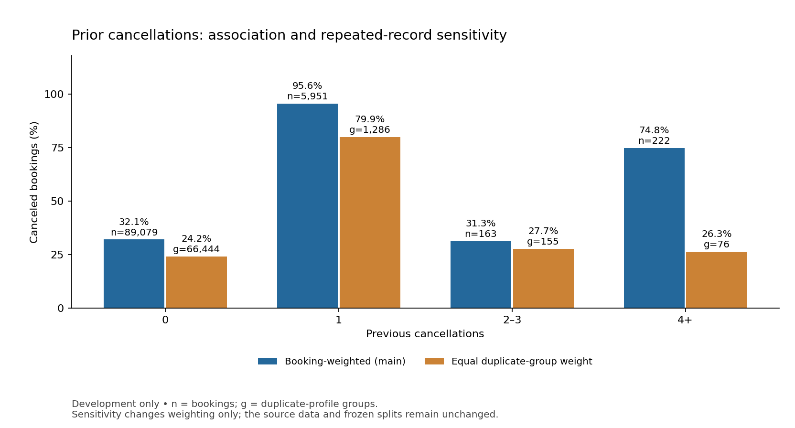

# Hotel Booking Cancellation Project

**CSE437: Data Science | Group 15**

| Member | Student ID |
| --- | --- |
| Faraaz Jamil Chowdhury | 24241205 |
| Ihfaz Rashid Sadat | 23301499 |

Repository: https://github.com/faraaz1027-cloud/cse437-hotel-cancellation-15

**Working report:** Sections 1–3 are drafted from verified Steps 1–8. Later modeling/results sections and the final PDF are pending. Finalize to the supplied template within 10 pages.

## Summary

Pending final results. Write the required 150–200-word summary last.

## 1. Problem and Dataset

### 1.1 Problem statement

Hotel booking cancellations can cause loss of money and make room planning difficult for hotels. The goal of this project is to study the factors that affect booking cancellations and build a machine-learning model that can predict whether a hotel booking will be canceled.

### 1.2 Dataset

The project uses Jesse Mostipak's [Hotel Booking Demand dataset](https://www.kaggle.com/datasets/jessemostipak/hotel-booking-demand), documented by Antonio et al. [1]. The supplied CSV combines city/resort hotel reservations: 119,390 rows, 32 columns, and 16,855,599 bytes (16.86 MB). Recorded arrivals span 2015-07-01 to 2017-08-31. The original publication describes extraction from hotel property-management databases.

The original bytes are preserved; the file checksum is in [data/README.md](../data/README.md). Exact download date, source version, and Kaggle licence still require confirmation. The raw CSV must still be committed for final submission.

### 1.3 Target and analytic population

The target is `is_canceled`: 1 for canceled and 0 otherwise. The original data contain 44,224 canceled and 75,166 noncanceled bookings. Excluding 180 records with a confirmed total of zero guests leaves 119,210 bookings. Missing guest counts do not establish zero guests.

The frozen development cohort has 95,415 bookings (2015-07-01 through 2017-04-22): 34,473 canceled and 60,942 noncanceled, a cancellation rate of **36.13%**. The 23,795 later bookings are reserved for final testing. Section 3 uses development data only; no held-out class distribution or model score is reported.

### 1.4 Approved research questions

1. Which booking and customer-related factors have the biggest effect on hotel cancellations?
2. How accurately can machine-learning models predict whether a hotel booking will be canceled?
3. Which machine-learning model gives the best result after data preprocessing, feature selection, dimensionality reduction, and hyperparameter tuning?

The wording above is unchanged. The predeclared factors are lead time, deposit type, and prior cancellations; observational associations are not treated as causal effects.

## 2. Data Handling and Preprocessing

### 2.1 Audit and eligibility

The original audit found 31,994 additional exact full-row copies, four missing child counts, 488 missing countries, 16,340 missing agents, and 112,593 missing companies. ADR ranged from −6.38 to 5,400. Both reservation-status fields encode outcome information and are excluded from predictors; the target is stored separately.

| Stage | Rows | Source predictor fields |
| --- | ---: | ---: |
| Original CSV | 119,390 | 29 after separating target and two status fields |
| Known-zero-guest exclusion | −180 | Unchanged |
| Eligible cohort | 119,210 | 29 |
| Initial preprocessing schema | 119,210 | 25 |

No booking identifier distinguishes accidental copies from legitimate repeated reservations. Records are retained and grouped by the 29 candidate fields for partition checks. No group crosses development/test or train/validation within a fold. The Step 8 equal-group analysis changes descriptive weighting only.

### 2.2 Missing values and outliers

For model preprocessing, negative ADR becomes missing; zero and high positive prices remain. Numeric medians are fitted inside each training fold. Missing country becomes `Unknown`; missing agent becomes `NoAgent` under the source NULL convention [1]. Agent IDs are nominal strings. Explicit `Undefined` categories remain distinct from unknown values.

The sparse company identifier and three potentially updated fields—assigned room, booking changes, and waiting-list days—are excluded from the initial model schema. This conservative policy does not prove booking-time availability of every retained field. A company-presence feature remains a Step 9 candidate.

### 2.3 Transformations, scaling, and encoding

Lead time, prior cancellations, prior noncanceled bookings, and ADR receive log1p after imputation. Numeric scaling and one-hot vocabularies are learned only from each training fold. Unseen categories map to an all-zero block for that field. Children and ADR retain missing indicators. A tree-compatible variant omits numeric standardization. Entirely missing training columns use a documented zero fallback.

The three folds produce 328, 422, and 491 encoded columns, respectively; each train/validation pair has matching width and zero nonfinite values. ADR training medians are 76.50, 80.75, and 90.00. The negative ADR occurs in fold 3 validation and uses 90.00. No extra rows are removed and no final test row is fitted/transformed during these checks.

### 2.4 Reproducibility

Notebook 02 and reusable modules implement Steps 5–7; [the split plan](../data/splits/step6_split_plan.json) fixes dates and metrics. Section 3 EDA applies only fixed domain rules and reports observed-value statistics without statistical imputation. The original full-source quality audit was inspected before the holdout was constructed; that limitation is disclosed.

## 3. Statistical Analysis

### 3.1 Development descriptive statistics

All rows in this section belong to development. Negative ADR is counted as missing; valid ADR includes zero and high positive values. Missingness uses field-specific denominators.

| Field | Valid n | Mean | Median | Q1–Q3 | Maximum |
| --- | ---: | ---: | ---: | --- | ---: |
| Lead time (days) | 95,415 | 96.59 | 60 | 15–145 | 737 |
| ADR (source units) | 95,414 | 93.71 | 88 | 65–115 | 5,400 |
| Previous cancellations | 95,415 | 0.106 | 0 | 0–0 | 26 |
| Weekday nights | 95,415 | 2.45 | 2 | 1–3 | 50 |
| Weekend nights | 95,415 | 0.90 | 1 | 0–2 | 19 |

These summaries show skew in lead time and ADR and a concentration of prior cancellations at zero. Full descriptive, missingness, category, and monthly tables are in [data/eda](../data/eda/README.md). April 2017 ends on the 22nd and is a partial month.

### 3.2 Relationships and observations

1. **Lead time:** the cancellation rate rises across fixed bins, from **9.43%** at 0–7 days (n=17,247) to **80.81%** at 366+ days (n=2,079). The ascending pattern also appears within each hotel. This supports the planned association, not a causal effect.

2. **Deposit type:** non-refundable bookings have **99.25%** cancellation (n=12,296), versus **26.82%** without a deposit (n=82,979). Refundable bookings have **10.71%**, but only 140 records. Non-refundable rates remain high within both hotels. Policies, booking mix, or recording timing could contribute; no causal explanation is established.

3. **Prior cancellations:** rates are **32.07%, 95.65%, 31.29%, and 74.77%** for 0, 1, 2–3, and 4+ respectively. Counts are 89,079; 5,951; 163; and 222. The relationship is not monotonic; sparse higher-count groups require caution.
4. **Hotel mix:** City Hotel's rate is **41.41%** (n=62,827), compared with **25.94%** for Resort Hotel (n=32,588). Pooled interpretations should account for this difference.
5. **Repeated-record sensitivity:** assigning total weight one to each of 67,961 duplicate-profile groups changes the overall rate from **36.13% to 25.26%**. For 4+ prior cancellations, **74.77% becomes 26.32%**. Conflicting labels within a profile are averaged, not discarded. This alternative describes an average profile rather than an average booking; neither is asserted to be a correction to an unknown true population.

These are descriptive associations, not model importance rankings or predictive performance. No p-values or row-independent confidence intervals are used because retained records need not be independent. Later modeling must preserve the frozen split, examine development-only comparisons, and avoid choosing settings from final test results.

## 4. Feature Engineering

Pending Steps 9–10: derived features, justified final feature set, feature selection, and dimensionality reduction. Step 7 policy exclusions do not satisfy statistical selection/reduction.

## 5. Modeling and Validation

Protocol fixed: chronological development/test split and three expanding validation folds; mean cancellation-class F1 is primary, with accuracy, precision, recall, and ROC-AUC secondary. Majority baseline, logistic regression, and random forest are planned. Model fitting remains pending.

## 6. Hyperparameter Tuning

Pending: report search spaces, candidate/fold counts, scoring, results, and selected configurations.

## 7. Results, Visualization, and Error Analysis

Pending: final test table/figures, at least two actual wrong predictions, and answers to all three approved questions. EDA is not final model evaluation.

## 8. Limitations and Next Steps

Current limitations include source timing, repeated-record weighting, small groups, seasonal coverage, and incomplete source provenance. Extend after modeling.

## 9. Contributions

Faraaz owns Steps 1–8 and draft Sections 1–3; Sadat owns Steps 9–15 and later report assembly. Record each member's actual reviewed/implemented work and commits before submission. Do not treat assigned ownership as proof of personal work.

## References and assistance

[1] Antonio, N., de Almeida, A., and Nunes, L. (2019). Hotel booking demand datasets. *Data in Brief*, 22, 41–49. https://doi.org/10.1016/j.dib.2018.11.126

[2] Jesse Mostipak. Hotel Booking Demand. Kaggle. https://www.kaggle.com/datasets/jessemostipak/hotel-booking-demand . Exact version, download date, and licence pending verification.

OpenAI ChatGPT/Codex assisted with scaffolding, user-approved transcription, code, testing, execution, figures, interpretation, and this draft. No predictive results have been fabricated. Notebook 01 preserves ten earlier IPython-executed audit cells and adds five Python-executed EDA cells with actual captured outputs. Full fresh-kernel notebook execution and canonical format validation remain final gates. Produce report.pdf after completing and checking the report.
