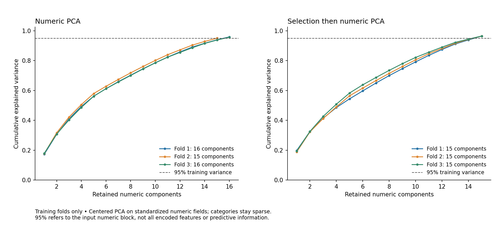

# Step 10 — Feature selection and dimensionality reduction

**CSE437 Group 15 | Owner: Sadat | Complete | Next: Step 11 (Sadat)**

Selection alone is the current preferred representation for the fixed logistic-
regression reference: mean development F1 is **0.713609**, versus **0.693094**
with all Step 9 features. Numeric PCA and selection followed by PCA were both
implemented and evaluated, but scored lower than selection alone. PCA is kept
as a documented experiment rather than included in the preferred pipeline.

## Fixed comparison protocol

Before the comparison, `comparison_protocol.json` fixes four modes: all Step 9
features (`full`), supervised selection (`selected`), numeric PCA (`pca`), and
selection followed by numeric PCA (`selected_pca`). No feature/target definitions,
cohort membership, duplicate weights, or frozen splits change.

Selection removes columns with training variance at most 1e−12, ranks remaining
encoded features by ANOVA F against training cancellation labels, and retains
the top 75% rounded upward. Ties follow original encoded order. F statistics are
ranking heuristics; p-values are discarded because independent-row inference is
not justified. A category's one-hot column may be retained while another category
of the same source field is dropped. This is selection of encoded features, not
necessarily entire source variables.

PCA uses centered full SVD on standardized numeric inputs only, keeping the
smallest component count whose cumulative training variance exceeds the 95%
target. Categories and missing indicators stay sparse and bypass PCA. In the
combined mode, PCA operates on the numeric features retained by selection.
The largest dense numeric training block is **13,149,744 bytes (13.15 MB)**;
the full sparse categorical matrix is never densified.

All four modes use the same logistic-regression reference: C=1, lbfgs,
max_iter=2000, tol=1e−4, no class weights, random_state=42, and probability
threshold 0.5. Twelve fits compare four modes on the three frozen forward folds.
Every fit converged without a ConvergenceWarning (95–182 iterations). The mean
cancellation-class F1 is the prespecified primary comparison metric. Exact mean
ties favor fewer average output columns, then declared mode order.

This reference classifier makes the feature decision reviewable; Step 11 still
must evaluate the majority baseline and two model families, and Step 12 still
must report model hyperparameter tuning.

## Results and current choice

| Representation | Fold 1 F1 | Fold 2 F1 | Fold 3 F1 | Mean F1 | Output columns by fold |
| --- | ---: | ---: | ---: | ---: | --- |
| All Step 9 features | 0.643231 | 0.702455 | 0.733595 | 0.693094 | 332 / 421 / 490 |
| Selection only | 0.693691 | 0.714117 | 0.733020 | **0.713609** | 247 / 314 / 366 |
| Numeric PCA | 0.692187 | 0.662830 | 0.728881 | 0.694633 | 325 / 413 / 483 |
| Selection then PCA | 0.692859 | 0.680961 | 0.729248 | 0.701023 | 242 / 308 / 360 |

Selection improves mean F1 by **0.020515** over the all-feature reference while
reducing encoded width. The improvement is not uniform: fold 3 is slightly
worse. Mean precision rises from 0.681025 to 0.783364 while mean recall falls
from 0.753386 to 0.659498, so the preference reflects the chosen F1 metric and
does not mean improvement on every objective. Secondary metrics and fold SDs
are in the comparison CSV; SD across three temporal folds is descriptive, not
a confidence interval.

The current feature rule is therefore **75% training F-score selection without
PCA**, refitted inside every later model-training fold. Complete retained names
are saved per fold. A global full-development selection mask is not fitted now;
that refit belongs after all modeling choices are frozen.

Third-training-fold top-ranked features include non-refundable/no-deposit
indicators, country PRT, prior cancellation share, lead time, prior cancellations,
history presence, and special requests. These rankings are associations, not
causal effects or final model-importance findings. See the complete rankings
for all encoded fields and the retained/discarded flags.

## PCA evidence

| Fold | Numeric PCA inputs → components | Retained numeric variance | Selected numeric inputs → components | Retained selected numeric variance |
| --- | --- | ---: | --- | ---: |
| 1 | 23 → 16 | 95.8830% | 20 → 15 | 96.4056% |
| 2 | 23 → 15 | 95.0011% | 21 → 15 | 96.4178% |
| 3 | 23 → 16 | 95.6934% | 21 → 15 | 96.4710% |



PCA addresses correlated numeric totals/components but preserves variance, not
necessarily cancellation signal. The threshold applies to the numeric input
block, not the entire encoded dataset or predictive information. Complete
component coefficients, centering means, input names and explained variances
are saved in `representation_schemas.json`.

## Validation and limitations

Preprocessing, supervised ranking and PCA learn only from each training prefix.
Validation transformations preserve fitted state; validation labels are used
only to score reference predictions and compare representations. No held-out
feature/target distribution, transformation or prediction is computed. No rows
are removed and no final full-development model is fitted.

All **35 tests** pass, including six new tests for known-signal selection,
constant removal, tie handling, numeric-only centered PCA, preserved categories,
variance coverage, training-state isolation, invalid inputs and cloneable pipeline
integration. Notebook 03 retains five executed Step 9 cells and appends five
actually executed Step 10 Python cells. The saved JSON passes structural checks;
canonical nbformat validation and fresh Jupyter-kernel execution remain final
submission gates because those packages are unavailable in this runtime.

The four-way comparison uses the same development folds to choose a version,
so its scores are selection estimates rather than unbiased final performance.
Univariate scores may miss nonlinear interactions or rare categories. The
preferred representation may differ for random forest; Step 11 should keep an
all-feature control. Source timing, repeated bookings and temporal drift remain
limitations from earlier stages.

## Reproduce and hand off

```bash
python -m src.representation_audit
python -m unittest discover -s tests -v
```

For later modeling, place `BookingRepresentation(mode="selected")` inside the
estimator Pipeline passed to the unchanged development CV. It creates fresh
preprocessing, selection and optional PCA internally. Tree models can request
`scale_numeric=False` for full/selected modes; PCA modes require scaling.
Do not use a precomputed globally fitted matrix. Preserve the development-row
order expected by `development_cv`.

**Step 11 — Sadat:** implement the majority-class baseline, logistic regression,
and random forest in Notebook 04. Include the selected representation and an
all-feature control, report fold metrics, and retain the final test for Step 13.
Model hyperparameter search remains Step 12.

ChatGPT/Codex assisted with implementation, execution, testing, interpretation,
notebook outputs and documentation. Sadat should review the work and record
actual contributions; ownership alone is not proof of personal authorship.
