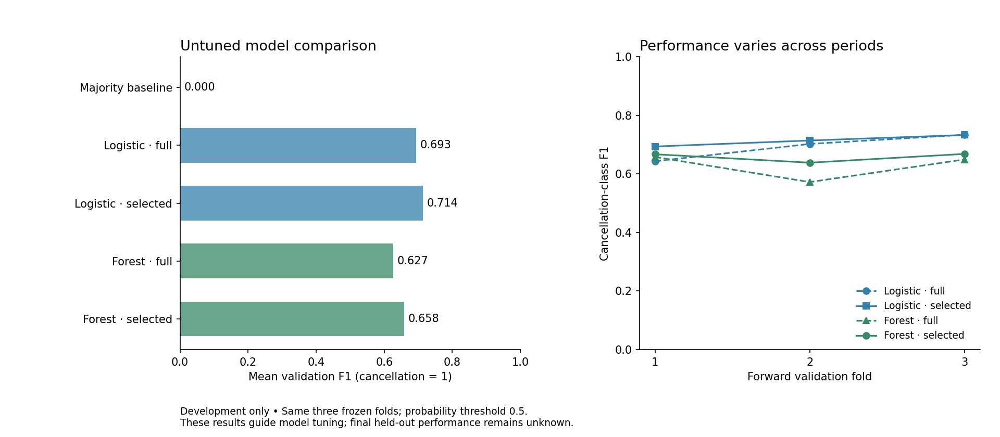

# Step 11 — Baseline and two model families

The leading untuned candidate is **Logistic regression — selected**, with mean development
cancellation F1 **0.713609**. This is a starting point for tuning,
not the final best-model or test result. Five candidates were fitted on the same
three frozen forward folds, giving 15 model fits.

## Models, settings and validation

The majority baseline predicts the class most frequent in each training fold
and ignores predictors. Logistic regression provides a regularized linear
reference; random forest supplies a distinct nonlinear tree-ensemble family.
Both learned families compare full Step 9 features with Step 10's selected
features (75% of nonconstant training columns by ANOVA F ranking).

- Logistic regression: C=1, lbfgs, max_iter=2000, tol=1e−4, no class weights,
  random_state=42; numeric fields are scaled inside training folds.
- Random forest: 100 trees, Gini criterion, unlimited depth, min_samples_split=2,
  min_samples_leaf=1, max_features=sqrt, bootstrap=True, no class weights,
  random_state=42, n_jobs=2; the verified unscaled numeric variant is used.
- Threshold: cancellation probability ≥0.5 predicts class 1 for every model.
  No resampling, threshold optimization or model-parameter search occurs.

The protocol is written before fitting. Each candidate receives a new pipeline
whose preprocessing and selection fit only on its training prefix. All
candidates use identical validation membership in each fold. No validation
labels fit a selector and no held-out row is fitted, transformed or scored.

The primary metric is the unweighted mean cancellation-class F1 across three
folds. Accuracy, precision, recall and ROC-AUC are secondary. Fold standard
deviations are descriptive, not confidence intervals. Logistic results match
the previously published Step 10 full/selected metrics within 1e−12.

## Measured development results

| Candidate | Mean F1 | Accuracy | Precision | Recall | ROC-AUC |
| --- | ---: | ---: | ---: | ---: | ---: |
| Majority baseline | 0.000000 | 0.638167 | 0.000000 | 0.000000 | 0.500000 |
| Logistic regression — full | 0.693094 | 0.751370 | 0.681025 | 0.753386 | 0.876098 |
| Logistic regression — selected | 0.713609 | 0.809314 | 0.783364 | 0.659498 | 0.882905 |
| Random forest — full | 0.626504 | 0.793498 | 0.906662 | 0.481119 | 0.886473 |
| Random forest — selected | 0.657994 | 0.803866 | 0.893717 | 0.521714 | 0.892267 |



The majority classifier predicts no cancellations in all three folds. Its mean
accuracy is **63.82%**, but cancellation precision/recall/F1 are
zero and ROC-AUC is 0.5. Accuracy alone would conceal that failure.

For logistic regression, selection changes mean F1 by **+0.020516** versus
full features. For random forest, the change is **+0.031490**. The best
representation within each family is `lr_selected`
and `rf_selected` under these fixed settings. These
preferences may change after model tuning; they do not show that a field is
universally useful or useless.

## Training scores and temporal variation

| Candidate | Fold 1 F1 | Fold 2 F1 | Fold 3 F1 | Mean training F1 | Mean training−validation F1 |
| --- | ---: | ---: | ---: | ---: | ---: |
| Majority baseline | 0.000000 | 0.000000 | 0.000000 | 0.000000 | 0.000000 |
| Logistic regression — full | 0.643231 | 0.702455 | 0.733595 | 0.817267 | 0.124173 |
| Logistic regression — selected | 0.693691 | 0.714117 | 0.733020 | 0.814529 | 0.100920 |
| Random forest — full | 0.657928 | 0.572253 | 0.649330 | 0.990300 | 0.363796 |
| Random forest — selected | 0.667216 | 0.638378 | 0.668386 | 0.990202 | 0.332209 |

Training scores are in-sample resubstitution diagnostics. The forest fits its
training data very closely while its later-period validation F1 is much lower.
This supports testing stronger regularization in Step 12, but does not prove
that capacity alone causes the gap: temporal shift and repeated-profile
structure also matter. The observed fold-to-fold variation must be reported.
Increasing model complexity has not by itself established better generalization.

Selection is learned separately for the linear and unscaled tree pipelines.
Complete output schemas are saved for every candidate/fold. Comparisons follow
the original row order and immutable forward folds; no records are removed or
reweighted to improve a score.

## Verification and limits

All **40 tests** pass, including five new tests for positive-class metrics,
threshold ties, invalid/misaligned inputs, majority-baseline behavior,
single-class probability handling, pipeline cloning, leakage rejection and
prediction without refitting preprocessing. All 15 comparison fits complete;
the six logistic fits issue no convergence warnings. Confusion counts reconcile
with validation sizes, and each fold's membership hash is identical across models.

Notebook 04 contains **six actually executed Python cells** with saved outputs.
The current runtime lacks Jupyter/IPython/nbformat; separate fresh-kernel runs
and canonical format validation remain final submission gates. These Python
execution checks do not establish that final notebook gate.

The same development folds have informed representation and model choices;
their scores can be optimistic and are not untouched-test estimates. The
original source-timing, repeated-record and provenance limitations remain.
No model has been refitted on all development data. No fold model pickle or
row-level prediction file is published; aggregate evidence is sufficient here.
The final fitted model is a later deliverable after settings are frozen.

## Reproduce and proceed

```bash
python -m src.model_comparison
python -m unittest discover -s tests -v
```

Results, confusion counts, estimator parameters, feature names and checksums
are in `data/results/step11/`. Use `make_model_pipeline` for later searches so
all preprocessing/selection is fitted inside CV. Step 12 should tune both
learned families with a documented modest grid or randomized search, report
the spaces and all candidate/fold scores, and compare against this untuned
reference. Consider regularization strength/class weighting for logistic
regression and depth, leaf size, feature sampling and tree count for forest.
Any threshold change must be selected using development data only and documented.
Keep the final test for Step 13 after all choices are frozen.
