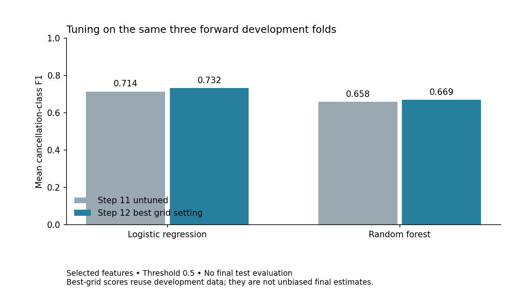

# Step 12 — Hyperparameter tuning

The development-selected model is **Logistic Regression**, with **C=1.0, class_weight=balanced** and mean
cancellation F1 **0.732102**. This is the best setting in the
declared grid, not proof of a globally optimal model or final test performance.
The approved dataset, target, problem statement and questions are unchanged.

## Search protocol and rationale

The complete grid was declared and persisted before the new scores were
computed. Both families keep the selected-feature representation from Steps
10–11: top 75% of nonconstant encoded training fields by ANOVA F. Numeric PCA
has been demonstrated but is not retained. It is not retuned in this step.

| Family | Parameter | Values |
| --- | --- | --- |
| Logistic Regression | C | 0.01, 0.1, 1, 10 |
| Logistic Regression | class_weight | None, balanced |
| Random Forest | max_depth | 8, 16, None (unlimited) |
| Random Forest | min_samples_leaf | 1, 10 |
| Random Forest | class_weight | None, balanced |

This gives 8 logistic and 12 forest settings, each on three frozen expanding
forward folds: **20 candidates and 60 fits**. Both grids include the exact
Step 11 selected-feature control. Logistic C tests stronger/weaker regularization;
forest depth/leaf size tests capacity controls in response to Step 11's large
training–validation gap. Balanced weighting tests the cancellation recall/
precision tradeoff without changing the target or primary metric.

Other settings remain fixed: logistic lbfgs/max_iter=2000/tol=1e−4; forest
100 trees, sqrt feature sampling and bootstrap. Seeds are 42. Logistic numerics
are scaled; forest numerics are unscaled. Search is sequential (`n_jobs=1`),
with two workers per forest. The modest grid is intentional; no adaptive grid
expansion or pursuit of a particular score occurs.

## Leakage-safe validation and scoring

`GridSearchCV` clones the complete raw-input pipeline for each candidate/fold.
Imputation, category vocabularies, scaling and supervised selection fit only
the training prefix. Balanced class weights are calculated separately from
each training fold. No oversampling, undersampling or dataset reweighting is
performed outside that explicit model option.

The primary metric is the **unweighted mean cancellation-class F1** across the
same three development folds. The probability rule remains **≥0.5 ⇒ class 1**.
A custom multimetric scorer uses that rule consistently for both models,
including exact ties. Accuracy, precision, recall, ROC-AUC and confusion counts
are also recorded. Exact mean-F1 ties follow the predeclared family and grid
order. There is no threshold search.

`refit=False` prevents an automatic full-development refit. Errors or convergence
warnings stop the experiment. The held-out test is never fitted, transformed,
scored or summarized. Source/split hashes and development row alignment are
verified before searching.

## Measured results

| Family | Selected search parameters | Untuned F1 | Tuned F1 | Change |
| --- | --- | ---: | ---: | ---: |
| Logistic Regression | C=1.0, class_weight=balanced | 0.713609 | 0.732102 | +0.018492 |
| Random Forest | class_weight=balanced, max_depth=None, min_samples_leaf=10 | 0.657994 | 0.669294 | +0.011300 |



| Family | Mean F1 | Accuracy | Precision | Recall | ROC-AUC | Training F1 | F1 gap |
| --- | ---: | ---: | ---: | ---: | ---: | ---: | ---: |
| Logistic Regression | 0.732102 | 0.800244 | 0.715322 | 0.756772 | 0.882666 | 0.827779 | 0.095677 |
| Random Forest | 0.669294 | 0.805928 | 0.876136 | 0.543722 | 0.889701 | 0.872311 | 0.203017 |

The complete 20-setting rankings, all 60 fold rows, raw sklearn CV outputs and
full estimator parameters are saved in `data/results/step12/`. The reported
candidate-table SD is sample SD over the three fold F1 values; sklearn's raw
CV tables use population SD. Neither is a confidence interval. Training F1 is
an in-sample diagnostic and not an independent generalization estimate.

Both untuned control settings reproduce their Step 11 per-fold F1, accuracy,
precision and recall within 1e−12, using identical validation membership.
Logistic ROC-AUC also matches within 1e−12. Forest ROC-AUC is checked to 1e−7;
exact differences and tolerances are recorded in `control_parity.csv`.
This supports attributing the measured differences to the declared model
settings under this protocol rather than an altered split or threshold.

## Limits and interpretation

The logistic winner retains C=1 and changes class weighting to balanced.
Mean cancellation recall rises from 0.659498 to 0.756772, while precision
falls from 0.783364 to 0.715322 and accuracy from 0.809314 to 0.800244.
The F1 improvement therefore reflects a measured tradeoff, not a gain on all
metrics. C=0.1 with balanced weights is close (mean F1 0.731697); the small
difference is not evidence of a statistically distinct or universally superior C.

The best forest combines balanced weights with min_samples_leaf=10 and unlimited
depth. Its training–validation F1 gap falls from 0.332209 to 0.203017, but its
mean validation F1 remains below the selected logistic model. Very shallow
forest settings underperform in this grid; regularization does not automatically
improve every setting. No additional search was triggered by these observations.

Representation and model tuning reuse development folds, so selection can make
winning scores optimistic. No nested CV or unbiased final test estimate is
claimed. The grid is finite; a winning edge value is not evidence that broader
search would improve performance. Differences in training–validation gaps
can reflect model capacity, temporal shift and repeated profiles together.

Class weighting can trade precision for recall. Evaluate that tradeoff using
the recorded secondary metrics; do not replace the agreed F1 objective because
another metric looks more favorable. All original source-timing, repetition,
partial-year coverage and provenance limitations remain. The project remains
a retrospective arrival-cohort analysis, not a validated live booking system.

## Verification and reproducibility

The first complete 60-fit run stopped during its final strict parity check:
forest ROC-AUC differed from Step 11 by at most 1.14e−8, while its threshold
metrics matched exactly. This is consistent with floating-point summation near
tied probability ranks. Only the secondary forest AUC comparison tolerance was
changed to 1e−7; the grid, metric calculations, threshold and selection rule
were not changed. A focused test rejects changes to F1 or larger AUC differences.
The unchanged 60-fit grid was rerun; the published notebook/results come from
that completed rerun (120 grid fits across the two attempts, excluding unit tests).

All **47 tests pass**, including seven new checks covering grid/control counts,
probability-threshold scoring, training-fold-only fit calls, no global refit,
protocol-change rejection, deterministic ranking, numerical parity and frozen-setting validation.
All 60 fits completed with zero failed fits and zero convergence warnings.
Confusion counts reconcile with fold sizes and cancellations; aggregate mean
scores are derived from actual per-fold scores.

Notebook 04 preserves six Step 11 code cells and appends five Step 12 code
cells executed sequentially in a fresh Python process with captured outputs.
A full 11-cell fresh Jupyter-kernel execution, canonical notebook validation
and clean dependency-install check remain final submission gates.

```bash
python -m src.tuning
python -m unittest discover -s tests -v
```

## Frozen evaluation configuration

`final_selection.json` stores the selected family, representation, complete
estimator settings, fixed threshold and frozen data lineage. It also preserves
the best setting within each family for interpretation, not to select a model
later using test scores. `build_frozen_pipeline(selection)` returns an unfitted
pipeline and rejects changed settings/defaults. **No final trained model is
claimed or saved yet.**

The selected pipeline is fitted on development rows only before final test evaluation. Test scores must not change the threshold, model family or selected settings.
