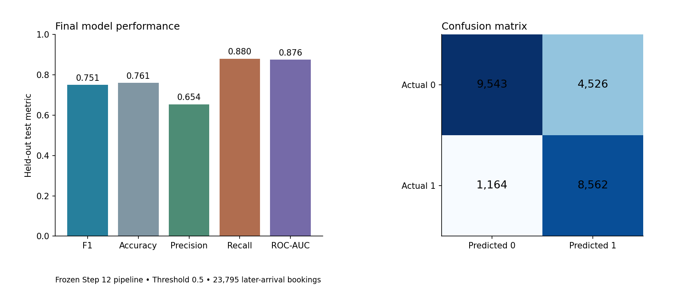
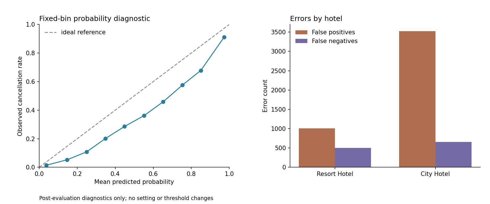

# Step 13 — Final evaluation and error analysis

**CSE437 Group 15 | Owner: Sadat | Complete | Next: Step 14 (Sadat)**

## Frozen model and official evaluation

Before test-label access, the protocol fixed the selected-feature Logistic
Regression pipeline, `C=1`, balanced class weights, and probability threshold
0.5 from Step 12. The complete preprocessing/selection/classifier pipeline was
fitted on all **95,415 development bookings**. It retained **406 encoded
features** and converged in 238 iterations. It was then evaluated once on the
**23,795 later-arrival bookings** from 2017-04-23 through 2017-08-31.

| Metric | Held-out result |
| --- | ---: |
| Cancellation-class F1 | **0.750592** |
| Accuracy | 0.760874 |
| Precision | 0.654187 |
| Recall | 0.880321 |
| ROC-AUC | 0.875977 |
| Brier score | 0.160007 |

The test set contains 9,726 cancellations (40.87%). Confusion counts are
**TN=9,543, FP=4,526, FN=1,164, TP=8,562**. The model detects 88.03% of
cancellations but only 65.42% of predicted cancellations are correct. Balanced
class weighting favors recall: false positives considerably exceed false
negatives. This tradeoff must accompany the F1 result.



Mean development F1 was 0.732102, versus 0.750592 on the held-out period. The
later result did not decline, but the difference is not an estimated improvement:
the periods have different cancellation rates and one holdout supplies neither
a sampling distribution nor a confidence interval.

## Where the model fails

City Hotel has a 25.59% error rate (3,521 FP; 659 FN), versus 20.24% for Resort
Hotel (1,005 FP; 505 FN). Raw counts partly reflect the larger City Hotel group.
Online TA is the largest and hardest market segment: 31.95% error, precision
0.5861 and recall 0.8681. Direct bookings have F1 0.5027; Complementary has F1
0.1667 but only 105 rows and 15 cancellations.

Lead-time performance varies markedly. For 0–7 days, cancellation F1 is 0.3344
and recall 0.4054; for 8–30 days, F1 is 0.5882. The model performs strongly on
366+ days (F1 0.9481), but this can reflect strong correlated signals and does
not establish a causal lead-time effect. No Deposit bookings account for almost
all errors (4,525 FP; 1,156 FN). Non Refund is nearly perfectly separated in
this period: 2,290 of 2,291 rows cancel. Refundable has only 22 rows, so its
metrics are unstable.



Predicted probabilities exceed observed cancellation rates in every populated
fixed bin. This is consistent with balanced weighting and shows that the scores
should not be presented as calibrated probabilities. Brier score is supplied
as a probability diagnostic, not as a tuning objective. Calibrating or changing
the threshold now would use test evidence and is therefore not performed.

## Concrete wrong predictions

The frozen example rule publishes five most-confident and five near-threshold
errors of each type. These are diagnostic extremes, not representative samples.

- False positive source row 14,182 (Resort Hotel, 80-day lead, Direct,
  No Deposit, one previous cancellation) received probability **0.999603** but
  was not canceled. The model can overgeneralize from cancellation-associated
  history/category patterns.
- False negative source row 94,387 (City Hotel, one-day lead, Complementary,
  Transient-Party, four previous cancellations, three special requests) received
  probability **0.006030** but canceled. Row 94,388 has the same displayed
  pattern and outcome, illustrating the retained repeated-profile limitation.
- Near-threshold errors lie within about 0.001 of 0.5; small probability changes
  would flip them, unlike the confident errors above.

All 20 examples and their safe booking fields are in `error_examples.csv`.
Reservation-status fields are excluded. Row IDs permit audit against the public
source without asserting that any individual field caused an error.

## Model inspection and limitations

The largest positive coefficient is `deposit_type_Non Refund` (+2.9297).
Several large coefficients belong to specific agent categories; required car
parking spaces has a large negative coefficient (−2.2908). Coefficients act on
encoded/scaled inputs, so magnitudes are not uniformly comparable and are not
causal feature importance. Rare categories can produce unstable estimates.

Subgroup analysis occurred only after official test access and did not alter
the model, fields, weights or threshold. A single chronological holdout remains
period-specific. Retained repeated profiles, incomplete source timing, partial
seasonal coverage, uncertain live-prediction availability and unfinished source
provenance constrain generalization. High performance for Non Refund and long
lead-time groups may reflect dominant associations or recording practices.

## Verification and handoff

All **53 tests pass**, including six Step 13 tests for immutable protocol,
threshold alignment, subgroup/probability reconciliation, distinct error
examples, leakage-safe exports, coefficient shape and serialization round trips.
Input and Step 12 hashes match; prediction leaves the fitted representation
unchanged. The complete fitted pipeline is saved in
`models/final_logistic_regression.joblib`; aggregate evidence, row predictions,
coefficients and checksums are in `data/results/step13/`.

Notebook 05 has six cells executed in a fresh Python process that load, inspect
and verify the completed official evaluation. A full fresh-Jupyter run,
canonical notebook validation and clean-install check remain final gates.

```bash
python -m src.final_evaluation
python -m unittest discover -s tests -v
```

Step 14 should answer the three unchanged questions using measured EDA,
development comparisons and this final test result. Do not claim causality,
global optimality or calibrated probabilities; do not reselect after test.

ChatGPT/Codex assisted with implementation, testing, execution, interpretation,
notebook outputs and documentation. Sadat should review and record actual work;
assigned ownership is not proof of personal authorship.
