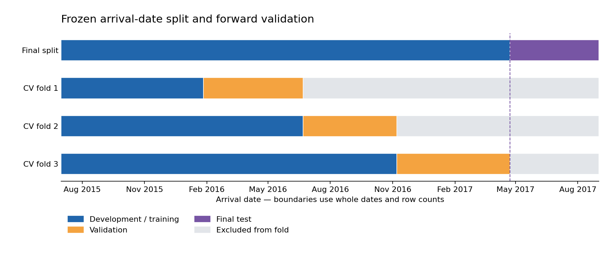

# Step 6 — Chronological evaluation plan

**CSE437: Data Science | Group 15 | Responsible: Faraaz | Status: complete**

**Next: Step 7 — Faraaz implements preprocessing inside the training folds.**

## Decision and scope

The question is whether the model generalizes to later arrival cohorts.
Use approximately 80% of eligible bookings for development and the latest 20%
for a final test. Preserve whole dates and the duplicate groups established in
Step 5. The boundary is chosen by the nearest prefix row count; ties favor the
earlier date. Cancellation outcomes and model scores do not choose the dates.

This is retrospective arrival-cohort evaluation. It is not a booking-creation
deployment simulation: the original source lacks reliable creation-time
snapshots for all fields and live label-availability records. No temporal gap
or embargo is applied. Prediction-time feature availability remains a review
item before modeling; the approved project wording is unchanged.

## Fixed holdout

| Partition | First arrival | Last arrival | Rows |
| --- | --- | --- | ---: |
| Development | 2015-07-01 | 2017-04-22 | 95,415 |
| Final test | 2017-04-23 | 2017-08-31 | 23,795 |

The partitions account for all 119,210 eligible bookings. All 67,961
development duplicate groups and 18,746 test duplicate groups remain separate.
The target is not recomputed or changed, and no records are added or removed.

## Forward cross-validation

Within development, whole-date boundaries near 25%, 50%, and 75% cumulative
row counts define three validation blocks. Training expands over time.

| Fold | Training dates | Training rows | Validation dates | Validation rows |
| --- | --- | ---: | --- | ---: |
| 1 | 2015-07-01 – 2016-01-26 | 23,797 | 2016-01-27 – 2016-06-21 | 23,893 |
| 2 | 2015-07-01 – 2016-06-21 | 47,690 | 2016-06-22 – 2016-11-06 | 23,776 |
| 3 | 2015-07-01 – 2016-11-06 | 71,466 | 2016-11-07 – 2017-04-22 | 23,949 |

Earlier validation rows become training rows in subsequent folds, as expected
for expanding forward validation. There is no row or duplicate-group overlap
between training and validation within any one fold. The initial training block
does not receive validation predictions. Every later development row validates
once, and the final test is excluded from all folds. Blocks have similar counts
but unequal calendar durations; inspect fold-level variation in later results.



## Metrics and model-selection commitments

- Primary: F1 for cancellation class 1, with unweighted mean across the three
  forward folds; report individual folds and variability. Set `zero_division=0`
  where precision/F1 is undefined.
- Secondary: accuracy, precision, recall, and ROC-AUC. ROC-AUC uses continuous
  probabilities or decision scores.
- Planned comparisons: majority-class dummy baseline, logistic regression,
  and random forest, all using the identical validation assignments.
- Default probability threshold: 0.5. Any threshold search, transformation
  choice, feature selection, dimensionality reduction, or hyperparameter choice
  must use development data only. Their validation scores are selection scores,
  not an independent final performance claim.
- No shuffle or split seed is needed. Use seed 42 for later stochastic
  estimators/searches and record any additional randomness.
- After selecting all settings, freeze the full pipeline and refit on all
  development data. Use the final test once in Step 13 for evaluation and error
  analysis. Do not tune further in response to that result.

## Implementation and verification

The [split module](../src/splitting.py) verifies Step 5 hashes, uses only
metadata for membership, exports assignments, and rejects inconsistent changes
to a frozen plan. The compressed CSV preserves original cohort row order.
The helper `development_cv` produces indices relative to the development subset
for scikit-learn; an example in [data/splits/README.md](../data/splits/README.md)
documents alignment explicitly.

Checks confirm full row accounting, unique source positions, strictly earlier
training dates, whole-date boundaries, zero duplicate-group contamination,
zero test rows in CV, and expanding training periods. Both outcome classes are
present in each fixed development training/validation block. That class check
is performed after fixing the dates and does not influence membership. No
holdout class distribution or model score is calculated for Step 6.

Seven targeted split tests cover nonchronological source order, relative CV
indices, target independence, deterministic ties, identity/group problems,
test contamination, insufficient dates, and frozen-plan protection. The four
existing Step 5 tests also pass (11 tests total).

Notebook 02 has nine code cells, executed sequentially in a fresh Python
process using IPython with actual outputs. Its end-to-end checks verify
compressed-file reloads, unchanged Step 5/source hashes, and byte-preserving
reruns of the frozen split. A separate fresh Jupyter-kernel run remains a
final submission verification task.

## Artifacts and commands

- Split assignments (`step6_assignments.csv.gz`) — generated and verified;
  public upload awaits explicit permission after automatic approval review.
- [Fixed plan and hashes](../data/splits/step6_split_plan.json)
- [Executed Notebook 02](../notebooks/02_preprocessing.ipynb)
- [Split tests](../tests/test_splitting.py)

From the repository root:

```bash
python -m src.splitting
python -m unittest discover -s tests -v
```

The split module can run from the committed processed files. Rerunning all of
Notebook 02 additionally requires the original CSV for the earlier Step 5 cells.

## Limitations and contribution disclosure

Later arrival periods may differ because of seasonality, hotel mix, or broader
changes. The source does not provide a real booking/guest identifier, so the
group guarantees apply to the recorded candidate-predictor duplicate groups.
Full-source raw-data quality summaries were inspected before the holdout was
defined; disclose this instead of claiming the holdout was never seen in any
form. No preprocessing or predictive model has been fitted in Step 6.

OpenAI ChatGPT/Codex assisted with the split design, code, documentation,
execution, and verification. Faraaz is responsible for reviewing and explaining
the work; the final contribution statement must describe actual member work.
